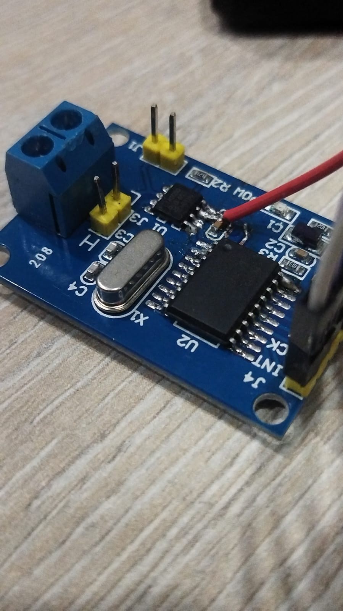
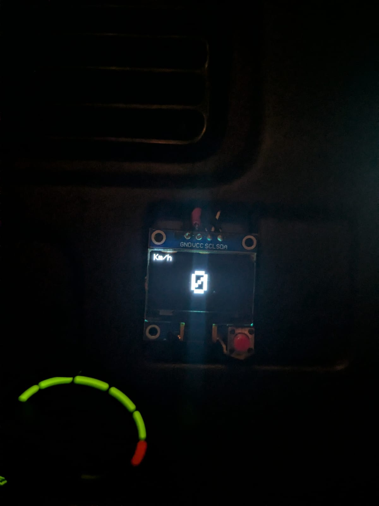
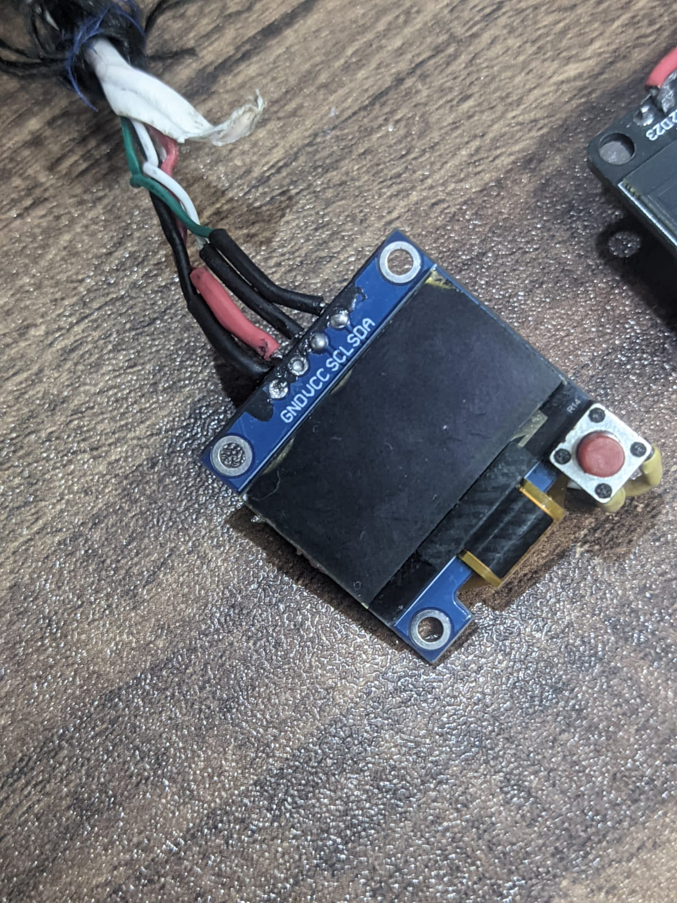
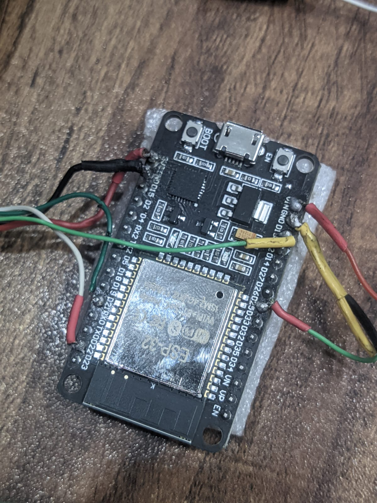
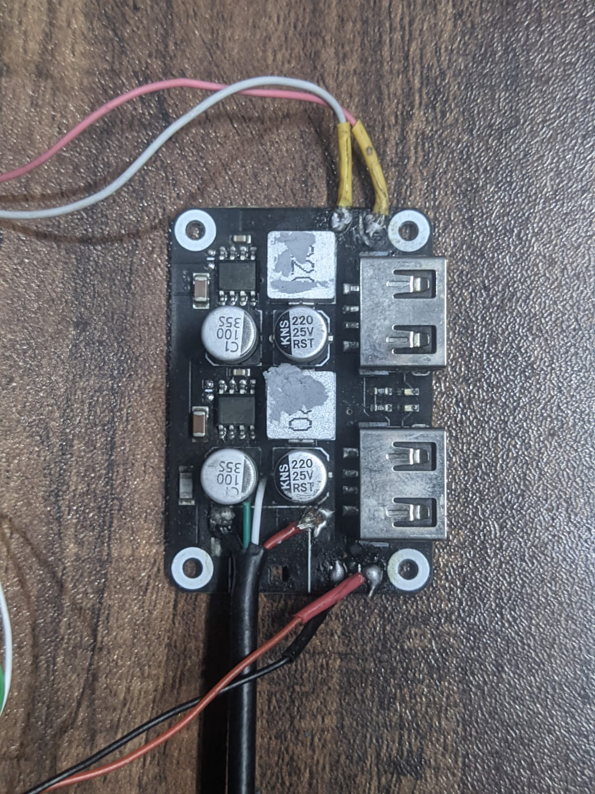
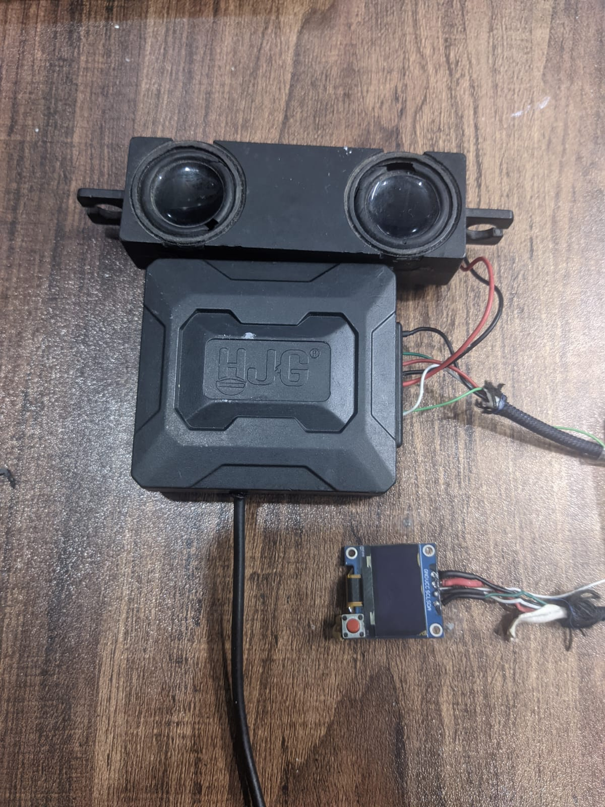

# ESP32 OBD2 Dashboard

A custom digital dashboard built on an ESP32, reading live engine data via OBD2 CAN bus and displaying it on a 0.96" OLED screen. Originally built for a **2005 Suzuki Alto VX (K6A VVT engine)** but designed to work on any OBD2-compliant vehicle.

> Built from scratch — hardware, firmware, and all — by [@AazibUmair](https://github.com/AazibUmair)

---

## Showcase

[

*Installed and running in the 2005 Suzuki Alto VX — live OBD2 data on a 0.96" OLED*
---

## What It Does

- **8 live gauge pages** — cycle through with a single button
- **Speedometer, Tachometer, Odometer + Trip, Voltmeter, Coolant Temp, AFR, Fuel Average (long-term), Instant Fuel**
- **Warning overlays** with buzzer alerts for Overheat, Handbrake, Engine Cold, Cold RPM, DTC fault codes
- **Boot logos** — Suzuki logo then custom Lord Alto logo on startup
- **Odometer persistence** — survives power cycles via NVS (non-volatile storage)
- **Engine off detection** — freezes fuel calculations when engine stops

---

## Hardware Used

| Component | Details |
|---|---|
| Microcontroller | ESP32 WROOM-32 (30-pin dev board) |
| CAN interface | MCP2515 module (8MHz crystal) — **modified for 3.3V logic** |
| Display | SSD1306 0.96" OLED 128×64 I2C |
| Buzzer | KXG1203C active buzzer 5V |
| Buzzer driver | BC547 NPN transistor + 1kΩ resistor + 1N4148 diode |
| Handbrake input | 1N4148 diode + internal pull-up on GPIO34 |
| Power supply | Dual USB step-down module (12V car → 5V) |
| Button | Tactile push button (page navigation) |

**Total cost: approximately PKR 3,000–3,800 / $10–13 USD** (all sourced locally)

---

## MCP2515 Modification ⚠️

The stock MCP2515 module runs on **5V logic** which will damage the ESP32's 3.3V GPIO pins. You must modify it to run on dual voltage before connecting.



**What to do:**
- The MCP2515 chip itself runs fine at 3.3V
- Replace the onboard 5V regulator or cut the VCC trace and feed 3.3V directly to the chip
- The CAN transceiver (TJA1050) still needs 5V for the bus side — power it from 5V separately
- Result: SPI logic talks to ESP32 at 3.3V, CAN bus side stays at 5V

This is a well-documented modification — search "MCP2515 3.3V modification" for step-by-step guides with your specific board variant.

---

## Pin Layout

### MCP2515 CAN Module → ESP32
| MCP2515 Pin | ESP32 Pin |
|---|---|
| VCC | 3.3V (after modification) |
| GND | GND |
| CS | GPIO5 |
| INT | GPIO4 |
| MISO | GPIO19 |
| MOSI | GPIO23 |
| SCK | GPIO18 |

### SSD1306 OLED → ESP32
| OLED Pin | ESP32 Pin |
|---|---|
| VCC | 3.3V |
| GND | GND |
| SDA | GPIO21 |
| SCL | GPIO22 |

### Other Connections
| Component | ESP32 Pin | Notes |
|---|---|---|
| Page button | GPIO13 | Pull-up to 3.3V, press = GND |
| Buzzer (via BC547) | GPIO26 | GPIO → 1kΩ → BC547 base |
| Handbrake switch | GPIO34 | GND switch + 1N4148 diode |

### Buzzer Wiring (BC547)
```
ESP32 GPIO26 ──── 1kΩ ──── BC547 Base  (middle leg, flat face toward you)
                           BC547 Emitter ──── GND  (right leg)
                           BC547 Collector ──[optional 100-220Ω]── Buzzer (-)
5V ──────────────────────────────────────────────────────────────── Buzzer (+)
1N4148 diode across buzzer terminals (stripe/band toward + side)
```

### Handbrake Wiring (GND switch)
```
Handbrake switch wire ──── 1N4148 Anode
                           1N4148 Cathode ──── GPIO34
                           GPIO34 uses internal pull-up (set in code)
```
When brake is up, switch closes to chassis GND → GPIO34 reads LOW → warning triggers.

---

## 8 Gauge Pages

| Page | Display | Notes |
|---|---|---|
| 0 | Speedometer | Large km/h, clean layout |
| 1 | Tachometer | RPM bar with 6500 RPM redline marker |
| 2 | Odometer + Trip | 6-digit ODO (persists to NVS), trip distance |
| 3 | Voltmeter | Battery voltage, charging status |
| 4 | Coolant Temp | Temperature bar 0–120°C, flashes when ≥100°C |
| 5 | AFR Gauge | Air/fuel ratio bar, RICH/STOICH/LEAN status |
| 6 | Long-term Fuel | Average km/L over full trip |
| 7 | Instant Fuel | Live km/L when moving, L/h at idle |

**Button:** single press = next page. Cycles 0→1→2...→7→0.

---

## Warning Overlays

All warnings show a full-screen black overlay with bold white text and a buzzer pattern.

| Warning | Condition | Buzzer | Duration |
|---|---|---|---|
| Engine Overheat | Coolant ≥ 100°C | Triple rapid beep, loops | 10s on / 10s off cycle |
| Engine Cold | First start, temp < 60°C | 3 fast beeps, once | 7 seconds |
| Cold Engine (RPM) | Temp < 60°C AND RPM > 2000 | Rapid triple, once | 4s, 5s cooldown, repeats |
| HandBrake | GPIO34 triggered AND speed > 0 | Double beep, loops | Until cleared |
| DTC Fault | Engine fault codes detected | Three medium beeps | 5s per code |

---

## Libraries Required

Install all via Arduino IDE Library Manager:

| Library | Author | Purpose |
|---|---|---|
| `Adafruit SSD1306` | Adafruit | OLED display driver |
| `Adafruit GFX` | Adafruit | Graphics primitives |
| `MCP_CAN` | coryjfowler | MCP2515 CAN bus |

Built-in (no install needed): `SPI`, `Wire`, `Preferences`

---

## Flashing Instructions

1. Install [Arduino IDE](https://www.arduino.cc/en/software)
2. Add ESP32 board support: File → Preferences → Additional Board URLs:
   ```
   https://raw.githubusercontent.com/espressif/arduino-esp32/gh-pages/package_esp32_index.json
   ```
3. Install libraries listed above
4. Copy all files into one folder:
   ```
   your_sketch/
   ├── your_sketch.ino
   ├── buzzer.h
   └── images.h
   ```
5. Select board: **ESP32 Dev Module**
6. Select correct COM port (install CP210x or CH340 driver if not detected)
7. Upload

**If you get a boot loop** after upload, hold the BOOT button on the ESP32 while pressing Upload in the IDE.

---

## Adapting for Other Vehicles / Motorcycles

The firmware uses standard **OBD2 PIDs over ISO 15765-4 CAN** (11-bit, 500kbps). This covers most cars and motorcycles made after 2008.

**To use on your vehicle:**
- Change `CAN_500KBPS` to `CAN_250KBPS` in setup if your vehicle uses 250kbps (some motorcycles and older cars)
- The handbrake GPIO is car-specific — disable it if not needed by setting `PIN_HANDBRAKE` to an unused pin
- Fuel calculations are tuned for the K6A engine — results on other engines will need calibration via the `FUEL_*` constants in the code
- Coolant temp and AFR pages work on any engine with those PIDs supported

**PIDs used:** RPM (0x0C), Speed (0x0D), Coolant Temp (0x05), Battery Voltage (0x42), MAF (0x10), O2 Sensor (0x14), STFT (0x06), LTFT (0x07)

---

## Photos

| | |
|---|---|
|  |  |
| *Installed in the Alto dashboard* | *OLED + button assembly* |
|  |  |
| *ESP32 with all connections* | *Dual USB 12V→5V power supply* |
|  |  |
| *MCP2515 modified for 3.3V ESP32* | *Version 1 wiring with speaker* |

---

## Known Issues / Tuning Notes

- **Long-term fuel average** needs tuning per engine — the MAP-based MAF estimation is calibrated for K6A. Other engines may read high or low.
- **Engine cold warning** will trigger even on a warm restart if ECU reports temp below 60°C momentarily — a debounce fix is planned.
- **Speed in reverse** is reported as positive by OBD2 — handbrake warning will trigger in reverse. This is an OBD2 limitation with no software fix without a dedicated reverse signal wire.
- **Odometer accuracy** depends on OBD2 speed polling rate — at highway speeds there may be slight drift vs factory odometer.

---

## Version History

See [CHANGELOG.md](CHANGELOG.md)

---

## License

MIT License — use it, modify it, build on it. Credit appreciated but not required.

---

## Author

Built by **Aazib Umair** — [@AazibUmair](https://github.com/AazibUmair)

If you build this or adapt it for your vehicle, open an issue or drop a star ⭐ — would love to see what people make with it.
